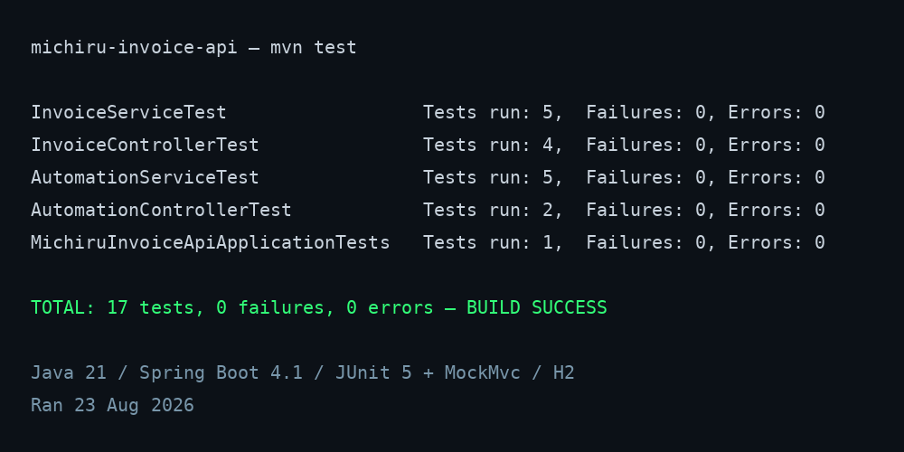

# Invoice Automation API

A production-shaped **Spring Boot REST API** that manages invoices and
automatically chases the unpaid ones — the backend of a two-part portfolio
demo, paired with the [Invoice Automation Dashboard](https://github.com/<your-handle>/michiru-dashboard).

> **The business problem it solves:** invoices get sent, then forgotten.
> This API tracks every invoice through a real state machine and runs a
> scheduled reminder engine that chases SENT invoices that are overdue or
> due soon — with a no-nagging rule so customers aren't spammed, and a full
> audit trail of every reminder that went out.

## What this demo shows a reviewer

This is not a toy CRUD:

- **A real state machine** — `DRAFT → SENT → PAID / CANCELLED`, with rules
  (a paid invoice cannot be deleted, terminals are terminal)
- **Business rules that can't drift** — invoice totals are *derived* from
  line items, never stored
- **Consistent error handling** — every failure returns the same JSON shape,
  with field-level validation messages
- **Workflow automation** — a scheduled engine that chases overdue and
  due-soon invoices, respects a per-invoice quiet period, and records every
  reminder to an audit trail (the email/SMS channel is simulated in this
  demo — the hook is the *mechanism*, which drops straight into a real
  integration)
- **Tested, not "it works"** — 17 unit + integration tests, all green:
  
- **Operationally ready** — Actuator health checks, Docker multi-stage
  build, H2 in-memory database with zero configuration

## Stack

Java 21 · Spring Boot 4.1 (WebMVC, Data JPA, Validation, Actuator) · H2 ·
Maven · JUnit 5 + MockMvc

## Quick start

```bash
# local (H2 in-memory, seeds 3 sample invoices)
./mvnw spring-boot:run        # or: mvn spring-boot:run

# API:        http://localhost:8080
# Health:     http://localhost:8080/actuator/health
# H2 console: http://localhost:8080/h2-console
#             (JDBC URL jdbc:h2:mem:invoicedb, user sa, empty password)
```

Docker:

```bash
docker compose up --build
```

## API surface

| Method | Path                    | Description                              |
|--------|-------------------------|------------------------------------------|
| POST   | `/api/invoices`         | Create an invoice (201 + Location)       |
| GET    | `/api/invoices`         | List with `?page=0&size=20&status=DRAFT` |
| GET    | `/api/invoices/{id}`    | Fetch one                                |
| GET    | `/api/invoices/overdue` | SENT invoices past their due date        |
| PATCH  | `/api/invoices/{id}/status` | Transition status (body: `"PAID"`)    |
| DELETE | `/api/invoices/{id}`    | Delete (409 if paid)                     |
| GET    | `/api/automation/status`| Reminder engine state (cron, last run, totals) |
| POST   | `/api/automation/run`   | Run a reminder cycle on demand           |
| GET    | `/api/reminders`        | Audit trail of reminders (latest 20)     |
| GET    | `/actuator/health`      | Liveness probe                           |

Example:

```bash
curl -s -X POST http://localhost:8080/api/invoices \
  -H "Content-Type: application/json" \
  -d '{
    "customerName": "Acme Corp",
    "customerEmail": "billing@acme.com",
    "dueDate": "2026-12-31",
    "items": [
      {"description": "API integration", "quantity": 2, "unitPrice": 250.00},
      {"description": "Setup", "quantity": 1, "unitPrice": 100.00}
    ]
  }'
```

Errors always come back in a consistent shape:

```json
{"timestamp":"…","status":400,"error":"Validation failed","messages":["customerName: customerName is required"]}
```

## The reminder engine (headline feature)

A `@Scheduled` job runs a cycle every 6 hours (`app.automation.cron`) over
SENT invoices:

- only **SENT** invoices are chased (DRAFT isn't billable; PAID is done)
- reason `OVERDUE` if past the due date; `DUE_SOON` within the configurable
  window
- **no nagging:** each invoice is reminded at most once per
  `reminder-gap-days` (3)
- every reminder is persisted to the audit trail (`GET /api/reminders`) —
  the email/SMS delivery channel is the production swap-in

Config (`application.properties`):

```properties
app.automation.enabled=true
app.automation.cron=0 0 */6 * * *
app.automation.reminder-days-before-due=2
app.automation.reminder-gap-days=3
```

`POST /api/automation/run` triggers a cycle on demand — handy for demos and
manual follow-ups.

## Tests

```bash
./mvnw test
```

17 tests across the service and web layers — state machine transitions,
delete rules, HTTP behaviour (201/400/404/409), and the automation cycle.

## Structure

```
src/main/java/com/demo/michiru/
├── config/    DataSeeder (sample data on startup)
├── dto/       Request/response records
├── model/     JPA entities + status enum
├── repository/ Spring Data repository
├── service/   Business rules + state machine + automation
└── web/       REST controller + global exception handler
```
